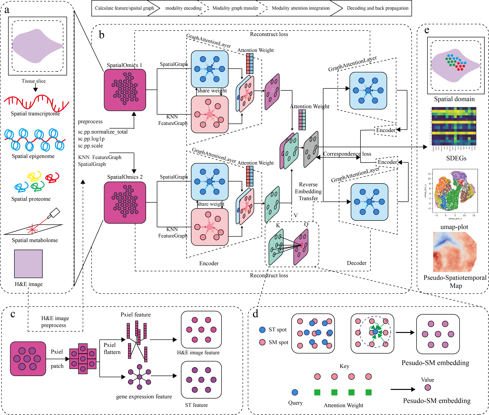

.. AgaeSMO documentation master file, created by
   sphinx-quickstart on Thu Mar 12 14:47:26 2026.
   You can adapt this file completely to your liking, but it should at least
   contain the root `toctree` directive.

Welcome to AgaeSMO's documentation!
===================================

.. toctree::
   :maxdepth: 2
   :caption: Contents:

   Installation
   Tutorials_ST_SM
   Tutorials_ST_SM_downstream
   Tutorials_ST_HE
   Tutorials_ST_HE_downstream
   Tutorials_paired_modality

